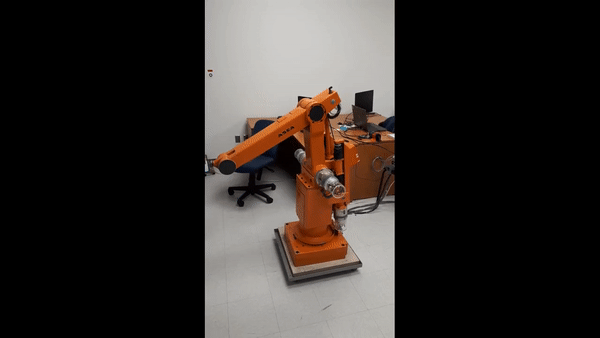
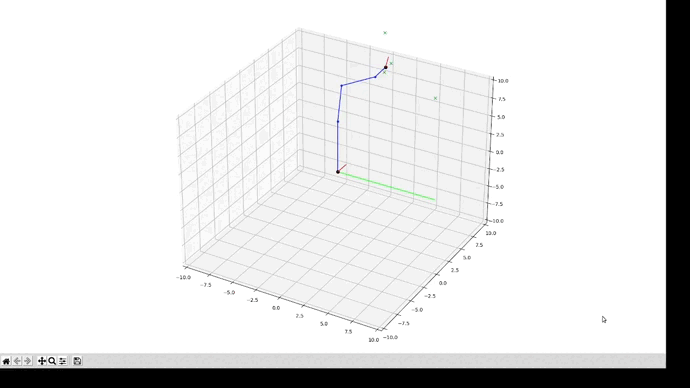

# ASEA-irb6

## Setup steps (for the Raspberry Pi)

    1) clone this repo (git clone ...) or transfer the (ASEA-irb6) folder over
    2) cd ASEA-irb6/setup/
    3) chmod +x rpi_setup.sh && ./rpi_setup.sh

After performing these steps, the robot control script **(main.py)** will be automatically launched when the Raspberry Pi is rebooted. The script will also be lauched automatically whenever the Raspberry Pi is powered on (when the system gets plugged into the wall).

## Raspberry Pi deployment notes

* Login credentials : login = ubuntu, password = initlab123
* The log file for the control script (asea_control.log) is located at : /asea_control.log

## Switching between predefied and randomly generated movements

As explained in the [general configuration section](readme.md#general-configuration), the movements made by the robot in between motion sensor triggers can be random or predefined, depending on the configuration file parameters. A good, way to test and visualize predefined movements is to use the [asea_simulation.py](init_irb6/asea_simulation.py) and [asea_control_and_simulation.py](init_irb6/asea_control_and_simulation.py) python scripts, which display a matplotlib 3D simulation of the robot's movements. In both scripts, the target end effector poitns are defined with a format similar to the one of the **(ee_positions)** configuration parameter.

## Detailing the configuration file (config.json)

The [config.json](config.json) configuration file allows tweaks to be made to each of the robot's axes and to the movement sensor. But, before diving into the configuration parameters, it's important to note that there are two types of motor axes on the robot (each with its own type of configuration parameters).
* Position controlled axes (shoulder axis -> **ax2**, elbow axis -> **ax3**, wrist flexion axis -> **ax4**).
    * These axes are equipped with a position encoder and they can be set to different positions via PID.
* Velocity controlled axes (waist axis -> **ax1** , wrist rotation axis -> **ax5**).
    * The axes aren't equipped with an encoder and are instead controlled via estimation of their constant rotation speed for at a predefined voltage.

In all cases, the axis motors are controlled by [4A DC motor Phidget](https://www.phidgets.com/?&prodid=1117) modules connected to a [Phidget VINT hub](https://www.phidgets.com/?tier=3&catid=2&pcid=1&prodid=643).

### General configuration

| Parameter | Description |
| :-------- | :---------- |
| hub_sn | (Integer) Serial number of the Phidget VINT hub. |
| log_file_path | (String) Relative path of the log file (from the ASEA-irb6 folder) where error messages will be written. |
| predefined_movements | (Boolean) When true, the robot will visit (sequentially) one of the end encoder positions specified by the (ee_positions) parameter each time the motion sensor is triggered. When false, the robot will execute a randomly generated movement each time the motion sensor is triggered. |
| ee_positions | ([[x1, y1, z1], [x2, y2, z2], ... ]) Predefined end effector positions for the robot. The robot will sequentially visit each position in between motion sensor triggers, if the **(predefined_movements)** parameter is set to true.|

### Axis configuration

#### Common parameters
---

| Parameter | Description |
| :------------- | :---------- |
| type | (String : "velocity" or "position") Defines the axis type. When "velocity", the axis is a velocity controlled axis. When "position", the axis is position-controlled. |
| hub_port | (Integer) Defines the port on the Phidget VINT hub to which the DC motor Phidget managing the axis is connected. |
| limit_switch_pin | (Integer or null) Defines the pin on the RaspberryPi's to which the axis limit switch is connected. Set to null if the axis does not have a limit switch or if it's not used. |
| current_limit | (Integer) Output current limit for the DC motor Phidget managing the axis. |
| max_angle | (Float) Upper bound of the axis range of motion (in degrees). |
| min_angle | (Float) Lower bound of the axis range of motion (in degrees). |

For more details about the motion range for each axis, consult the [kinematic calcultations](docs/calculs_modele.pdf) and [these pages](docs/dimensions.pdf) pulled from the ASEA IRB6's original documentation.

#### Position controlled axis configuration
---

| Parameter | Description |
| :------------- | :---------- |
| dead_band | (Integer) Tolerance (in encoder units) for target encoder positions. The position controller will relax control of the motor within the deadband, preventing the 'hunting' behavior. |
| max_velocity | (Integer) Maximum velocity that can be reached by the motor (encoder units/second). |
| acceleration | (Integer) Acceleration rate of the motor (encoder units / seconds ^ 2). |
| kd | (Float) Value of the kd parameter for the PID control. |
| ki | (Float) Value of the ki parameter for the PID control. |
| kp | (Float) Value of the kp parameter for the PID control. |
| starting_pos_deg | (Integer or null ) Position taken by the motor after the homing (in degrees). When null, the (starting_pos_enc) parameter is used. |
| starting_pos_enc | (Integer or null) Position taken by the motor after the homing (in encoder units). When null, the (starting_pos_deg) parameter is used. |
| min_angle_position | (Integer) The encoder value associated with the (max_angle) parameter. |
| max_angle_position | (Integer) The encoder value associated with the (min_angle) parameter. |
| movement_delay | (Float) Time delay (in seconds) once the axis movement is launched where the program waits for the completion of the movement. The delay should be slightly longer than the time taken by the axis motor to go from (min_angle) to (min_angle). |
| home_direction | (Integer) Guide value for the homing of the axis (in encoder units). When the axis is not equipped with a limit switch, this value should exceed the [min_angle_position, max_angle_position] interval to force the axis to reach one of the interval's extremes. When the axis is equipped with a limit switch, the amplitude and direction of the limit switch search movement is defined by ( home_direction - current position). |
| home_value_switch | (Integer) Position (in encoder units) assigned to the axis when it reaches its home (the switch). |
| home_value_no_switch | (Integer) Position (in encoder units) assigned to the axis when it reaches home (one of the extremities). |

For more information about the behavior of position-controlled axes, check out the documentation on the ***MotorPositionController*** API from Phidget.

#### Velocity controlled axis configuration
---
| Parameter | Description |
| :------------- | :---------- |
| acceleration | (Float) Acceleration rate of the motor. |
| default_pos | (Float or null) Default position (in degrees) assumed by the axis, before homing. When null, no position assumptions are made. |
| home_time | (Float) Time (in seconds) given to the axis to reach its home position. |
| starting_pos | (Float) Position (in degrees) assigned to the axis, once it reaches its home. |
| movement_velocity | (Float [0, 1]) Duty cycle value to be applied to the motor when moving the axis. This has a direct impact on the rotation speed. |
| real_movement_velocity | Measured rotation speed value (in degrees/second) corresponding to the chosen duty cycle value (movement_velocity). |
| home_direction | (Float) Guide value (in degrees) pointing towards the home position. |
| home_value_switch | (Float) Value (in degrees) assigned to the axis once it reaches its home position (the switch). |
| home_value_no_switch | (Float) Value (in degrees) assigned to the axis once it reaches its home position (one of the extremities). |

### Motion sensor configuration

The motion sensor used on the robot is the [1111 motion sensor module](https://www.phidgets.com/?prodid=81) from Phidget.

| Parameter | Description |
| :-------- | :---------- |
| ms_port | (Integer) Defines the port on the Phidget VINT hub to which the motion sensor is connected. |
| ms_volt_ratio_trigger | (Float [0, 1]) Sensibility of the sensor. The closer the value is to 1, the harder it is to trigger the sensor.  |
| ms_wait_time | (Float) Time delay (in seconds) between motion sensor triggers where the motion sensor can not be triggered. |